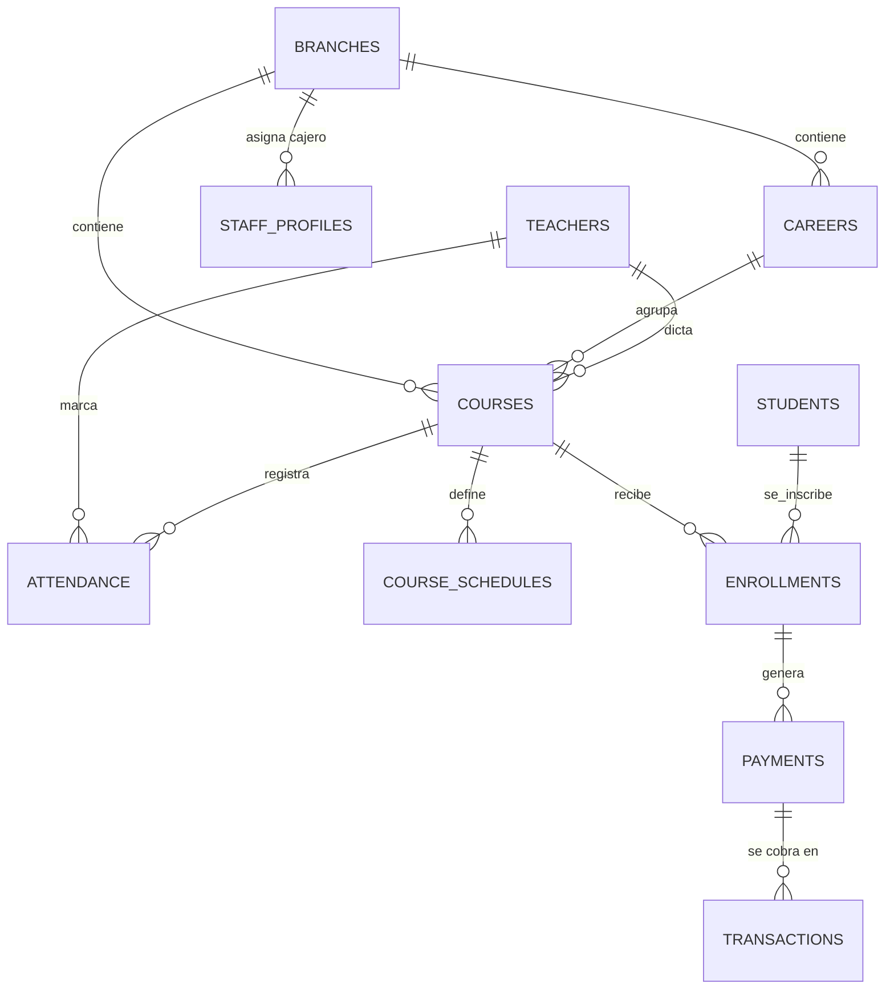

# Especificación del Sistema de Control de Mensualidades

## 1. Objetivo del sistema

Controlar las mensualidades de los estudiantes inscritos en el instituto: saber quién debe, registrar pagos, programar fechas de vencimiento, y administrar la inscripción de estudiantes a cursos. El sistema es usado por el personal del instituto (Administrador, Cajero, Encargado Académico) y por los **Docentes** con un acceso limitado (solo sus cursos y su marcaje de asistencia); los estudiantes **no** inician sesión ni acceden al sistema.

## 2. Stack tecnológico

- **Backend / Base de datos**: Appwrite
- **Frontend**: Next.js 16.2.10 (App Router)
- **Validación**: zod
- **Autenticación y roles**: Appwrite Auth + Appwrite Teams

## 3. Roles del sistema

| Rol                     | Descripción                                                                                                                                                                                                                                                                                                               |
| ----------------------- | ------------------------------------------------------------------------------------------------------------------------------------------------------------------------------------------------------------------------------------------------------------------------------------------------------------------------- |
| **Administrador**       | Poder total sobre el sistema: todo lo de los demás roles, más gestión de usuarios/roles y eliminación de registros.                                                                                                                                                                                                       |
| **Cajero**              | Crear estudiantes, crear cursos, abrir/cambiar el estado de los cursos, inscribir estudiantes a cursos, generar mensualidades y registrar pagos. **Asignado a una única sucursal**: solo opera dentro de esa sucursal.                                                                                                    |
| **Encargado Académico** | Cambiar el estado de los cursos (mismas transiciones que el Cajero) y gestionar los horarios de los cursos. Puede ver la lista de estudiantes inscritos en un curso (para control académico y de cupo), pero **sin ningún dato de pagos/mensualidades**. No puede crear/editar estudiantes, inscribir ni registrar pagos. |

### Matriz de permisos

| Acción                                                             | Administrador | Cajero                            | Encargado Académico    |
| ------------------------------------------------------------------ | ------------- | --------------------------------- | ---------------------- |
| Gestionar usuarios/roles                                           | ✅            | ❌                                | ❌                     |
| Crear/editar cursos                                                | ✅            | ✅                                | ❌                     |
| Cambiar estado del curso                                           | ✅            | ✅                                | ✅                     |
| Eliminar cursos                                                    | ✅            | ❌                                | ❌                     |
| Crear/editar estudiantes                                           | ✅            | ✅                                | ❌                     |
| Eliminar estudiantes                                               | ✅            | ❌                                | ❌                     |
| Inscribir estudiantes a cursos                                     | ✅            | ✅                                | ❌                     |
| Ingreso de mensualidades (generar mensualidades y registrar pagos) | ✅            | ✅                                | ❌                     |
| Gestionar horarios de curso (`courseSchedules`)                    | ✅            | ✅                                | ✅                     |
| Ver lista de inscritos de un curso (sin datos de pago)             | ✅            | ✅                                | ✅                     |
| Eliminar registros de pagos                                        | ✅            | ❌                                | ❌                     |
| Ver reportes                                                       | ✅            | ✅                                | ✅ (limitado a cursos) |
| **Anular un pago registrado**                                      | ✅            | ❌                                | ❌                     |
| **Crear sucursales**                                               | ✅            | ❌                                | ❌                     |
| **Crear cursos dentro de una sucursal**                            | ✅            | ✅ (solo en su sucursal asignada) | ❌                     |
| **Registrar/editar docentes**                                      | ✅            | ❌                                | ❌                     |
| **Descargar reporte de ingresos del día (cierre de caja)**         | ✅            | ✅                                | ❌                     |
| **Ver reporte histórico de ventas/ingresos (todos los periodos)**  | ✅            | ❌                                | ❌                     |
| **Ver módulo de liquidación/pago a docentes**                      | ✅            | ❌                                | ❌                     |

### Nuevo actor: Docente (acceso limitado, fuera del "staff")

El Docente es un **cuarto tipo de usuario**, distinto de Administrador/Cajero/Encargado Académico: tiene su propio login (Appwrite Auth) pero un alcance mucho más chico — no es parte del Team "staff", sino de un Team separado (ej. `"docentes"`), para no mezclar sus permisos con los del personal administrativo.

| Acción                                               | Docente                                                             |
| ---------------------------------------------------- | ------------------------------------------------------------------- |
| Ver sus propios cursos asignados y horarios          | ✅                                                                  |
| Marcar su propia asistencia (check-in / check-out)   | ✅ (solo su curso, solo el día que le toca según `courseSchedules`) |
| Ver su propio historial de asistencia                | ✅                                                                  |
| Ver estudiantes, pagos, otros cursos, otros docentes | ❌                                                                  |
| Ver su liquidación/pago calculado                    | ❌ (solo el Administrador puede verlo)                              |

**Nota**: no todo docente necesariamente tiene una cuenta de acceso — el campo `teachers.userId` es opcional; un docente sin `userId` simplemente no puede iniciar sesión (ej. si aún no se le ha creado su acceso).

## 4. Estados del curso

Un curso tiene un ciclo de vida con 4 estados posibles:

1. **En inscripciones** — el curso está abierto y se pueden matricular estudiantes.
2. **En clases** — el curso ya inició; normalmente no se matricula a nadie más.
3. **Terminado** — el curso concluyó su ciclo normalmente.
4. **Cerrado** — el curso fue cancelado/archivado.

**Regla de negocio**: un curso `terminado` no puede volver a `en_inscripciones` salvo que lo haga explícitamente un Administrador (excepción manual).

**Regla de negocio**: solo se puede inscribir a un estudiante en un curso si su estado es `en_inscripciones`.

## 5. Modelo de datos (colecciones de Appwrite)

### `students` (Estudiantes)

| Campo            | Tipo     | Notas                                                                                    |
| ---------------- | -------- | ---------------------------------------------------------------------------------------- |
| nombre           | string   | requerido                                                                                |
| apellido         | string   | requerido                                                                                |
| documento        | string   | requerido, único                                                                         |
| email            | string   | opcional                                                                                 |
| telefono         | string   | opcional                                                                                 |
| direccion        | string   | opcional                                                                                 |
| sucursalId       | string   | opcional, referencia a `branches` para estudiantes asignados a sucursal sin curso activo |
| fechaInscripcion | datetime | requerido                                                                                |
| estado           | string   | activo / inactivo / retirado                                                             |

### `branches` (Sucursales)

| Campo     | Tipo   | Notas                                       |
| --------- | ------ | ------------------------------------------- |
| nombre    | string | requerido (ej. "Sucursal Centro", "Online") |
| tipo      | string | requerido: presencial / online              |
| direccion | string | opcional (no aplica si `tipo = online`)     |
| telefono  | string | opcional                                    |
| estado    | string | activo / cerrado                            |

**Regla de negocio**: solo el Administrador crea/edita/elimina sucursales. Un curso siempre pertenece a una sucursal. **"Online" es una sucursal más** (tipo `online`), para cursos virtuales — un docente puede tener cursos asignados tanto en sucursales físicas como en la sucursal Online, sin restricción.

### `careers` (Carreras)

Agrupa varios cursos bajo un mismo programa/carrera, solo para fines organizativos y de reportes — no cambia la lógica de inscripción ni de pagos.
| Campo | Tipo | Notas |
|---|---|---|
| nombre | string | requerido (ej. "Diseño Gráfico") |
| descripcion | string | opcional |
| sucursalId | string | requerido, referencia a `branches` |
| estado | string | activo / cerrado |

### `courses` (Cursos)

| Campo         | Tipo     | Notas                                                                       |
| ------------- | -------- | --------------------------------------------------------------------------- |
| nombre        | string   | requerido                                                                   |
| descripcion   | string   | opcional                                                                    |
| sucursalId    | string   | requerido, referencia a `branches`                                          |
| carreraId     | string   | opcional, referencia a `careers` — nulo si es un curso suelto/independiente |
| orden         | integer  | opcional, posición del curso dentro de la carrera                           |
| docenteId     | string   | requerido, referencia a `teachers`                                          |
| fechaInicio   | datetime | requerido, inicio de clases usado para calcular la primera mensualidad      |
| precioMensual | double   | requerido (lo que paga el estudiante)                                       |
| precioPorHora | double   | requerido (lo que se le paga al docente por hora, para liquidación futura)  |
| duracionMeses | integer  | requerido                                                                   |
| cupoMaximo    | integer  | requerido, máximo de estudiantes que se pueden inscribir                    |
| estado        | string   | en_inscripciones / en_clases / terminado / cerrado                          |

**Regla de negocio**: no se puede inscribir a un estudiante si `enrollments` activas del curso ya alcanzó `cupoMaximo`.

### `teachers` (Docentes)

| Campo        | Tipo   | Notas                                                                                                             |
| ------------ | ------ | ----------------------------------------------------------------------------------------------------------------- |
| nombre       | string | requerido                                                                                                         |
| apellido     | string | requerido                                                                                                         |
| documento    | string | requerido, único                                                                                                  |
| email        | string | opcional                                                                                                          |
| telefono     | string | opcional                                                                                                          |
| especialidad | string | opcional                                                                                                          |
| estado       | string | activo / inactivo                                                                                                 |
| userId       | string | opcional — referencia a la cuenta de Appwrite Auth del docente, si tiene acceso al sistema para marcar asistencia |

### `courseSchedules` (Horarios del curso)

Un curso puede tener clases en varios días con distinto horario, por eso se modela como colección aparte (relación 1 curso → N horarios).
| Campo | Tipo | Notas |
|---|---|---|
| courseId | string | requerido, referencia a `courses` |
| dia | string | requerido: lunes / martes / miércoles / jueves / viernes / sábado / domingo |
| horaInicio | string | requerido, formato "HH:mm" |
| horaFin | string | requerido, formato "HH:mm" |

### `attendance` (Asistencia de docentes)

Registro de asistencia real del docente, usado para la liquidación (sección 18) y para control de puntualidad.
| Campo | Tipo | Notas |
|---|---|---|
| teacherId | string | requerido, referencia a `teachers` |
| courseId | string | requerido, referencia a `courses` |
| fecha | string | requerido, formato "YYYY-MM-DD" (fecha calendario del check-in, calculada en servidor) |
| horaEntrada | datetime | requerido — **generado por el servidor** en el momento de la petición, nunca enviado por el cliente |
| horaSalida | datetime | opcional — mismo criterio: hora de servidor, no del dispositivo |
| estado | string | a_tiempo / tarde — calculado comparando `horaEntrada` contra el `horaInicio` del `courseSchedule` de ese día |
| notas | string | opcional |

**Regla de negocio — confiabilidad del registro**: la `horaEntrada`/`horaSalida` **siempre se genera en el servidor** (Server Action / `$createdAt` de Appwrite) en el instante en que llega la petición; el cliente nunca puede enviar ni manipular la fecha/hora del marcaje. No se verifica ubicación geográfica en esta versión (decisión tomada: solo confiabilidad por hora de servidor).

**Regla de negocio**: un docente solo puede marcar asistencia de un curso donde `courses.docenteId` corresponda a su propio registro en `teachers`, y solo en un día que coincida con algún `courseSchedules.dia` de ese curso. No se permite más de un check-in por curso por día.

### `staffProfiles` (Asignación de sucursal al staff)

Vincula a cada usuario del staff (Appwrite Auth) con su sucursal, ya que Appwrite Teams solo maneja roles, no datos adicionales.
| Campo | Tipo | Notas |
|---|---|---|
| userId | string | requerido, único — referencia al usuario de Appwrite Auth |
| sucursalId | string | requerido para Cajero; nulo/no aplica para Administrador (opera en todas) |

**Regla de negocio**: cada Server Action que un Cajero ejecute (crear curso, inscribir estudiante, registrar pago) valida que el `sucursalId` del recurso coincida con el `sucursalId` de su `staffProfile`. El Administrador no tiene esta restricción.

### `enrollments` (Inscripciones — relación estudiante↔curso)

| Campo          | Tipo     | Notas                                                               |
| -------------- | -------- | ------------------------------------------------------------------- |
| studentId      | string   | requerido                                                           |
| courseId       | string   | requerido                                                           |
| fechaInicio    | datetime | requerido                                                           |
| montoMensual   | double   | monto final a pagar (ya con beca/descuento aplicado si corresponde) |
| tipoBeca       | string   | opcional: ninguna / porcentaje / monto_fijo                         |
| valorBeca      | double   | opcional, el % o el monto fijo de descuento según `tipoBeca`        |
| motivoBeca     | string   | opcional, obligatorio si `tipoBeca != ninguna`                      |
| diaVencimiento | integer  | requerido, día del mes en que vence la cuota (1-28)                 |
| estado         | string   | activa / finalizada / cancelada                                     |

### `payments` (Mensualidades — la "deuda" de cada periodo)

Cada fila representa una mensualidad que el estudiante debe. Los cobros reales se registran aparte, en `transactions` (una mensualidad puede pagarse en uno o varios cobros).
| Campo | Tipo | Notas |
|---|---|---|
| enrollmentId | string | requerido |
| studentId | string | denormalizado, para consultas rápidas |
| courseId | string | denormalizado, para reportes por curso sin joins |
| sucursalId | string | denormalizado, para reportes por sucursal sin joins |
| periodo | string | formato "YYYY-MM" |
| montoEsperado | double | requerido |
| montoPagado | double | default 0 — **suma de las `transactions` válidas** de esta mensualidad, nunca se edita a mano |
| fechaVencimiento | datetime | requerido |
| estado | string | pendiente / parcial / pagado / vencido — recalculado cada vez que se crea o anula una transacción |
| notas | string | opcional |

### `transactions` (Cobros individuales — el registro de caja)

Cada fila es **un cobro real** hecho en caja: quién cobró, cuándo, cuánto y por qué método. Es la fuente de verdad del cierre de caja y de los reportes de ingresos.
| Campo | Tipo | Notas |
|---|---|---|
| paymentId | string | requerido, referencia a `payments` (la mensualidad que abona) |
| studentId | string | denormalizado |
| sucursalId | string | denormalizado, para el cierre de caja por sucursal |
| monto | double | requerido, lo cobrado en esta transacción |
| metodoPago | string | requerido: efectivo / qr (QR Banco Económico) |
| referencia | string | opcional, número de comprobante o referencia del QR |
| fecha | datetime | **generada por el servidor** (zona horaria America/La_Paz), nunca por el cliente |
| registradoPor | string | requerido, userId del Administrador/Cajero que registró el cobro |
| estado | string | valida / anulada |
| anuladoPor | string | opcional, userId del Administrador que anuló |
| motivoAnulacion | string | opcional, obligatorio si `estado = anulada` |
| fechaAnulacion | datetime | opcional |
| notas | string | opcional |

**Regla de negocio**: al crear una inscripción activa, se generan automáticamente las mensualidades futuras según `diaVencimiento`.

**Regla de negocio**: una función programada (cron diario) marca como `vencido` cualquier pago cuya `fechaVencimiento` ya pasó y sigue en estado `pendiente`.

**Regla de negocio — Registro de cobros**: registrar un pago crea una `transaction` (con `registradoPor` = el usuario logueado y `fecha` = hora del servidor) y recalcula `payments.montoPagado` y `payments.estado` (`parcial` si aún no cubre `montoEsperado`, `pagado` si lo cubre). Los pagos parciales quedan perfectamente trazados: cada cobro aparece en el cierre de caja del día en que realmente ocurrió, con su método y su cajero.

**Regla de negocio — Anulación de cobros**: si quien registró el cobro (Administrador o Cajero) se equivoca, **solo el Administrador** puede anular esa transacción:

- Nunca se borra el registro (se conserva para auditoría).
- Cambia su `estado` a `anulada`, exige un `motivoAnulacion`, y guarda `anuladoPor` + `fechaAnulacion`.
- Recalcula `payments.montoPagado` (restando el monto anulado) y el `estado` de la mensualidad, que puede volver a `pendiente`, `parcial` o `vencido` según corresponda — el estudiante vuelve a aparecer correctamente como que debe.
- La transacción anulada queda visible en el historial (no desaparece, solo se marca) y se descuenta del cierre de caja del día si la anulación es del mismo día.

## 6. Estructura de la Base de Datos (resumen y relaciones)

Vista consolidada de todas las colecciones de Appwrite definidas en este documento y cómo se relacionan entre sí. El detalle campo por campo de cada una está en la sección 5; aquí se muestra el panorama completo del proyecto en un solo lugar.

### Colecciones y su propósito

| Colección         | Propósito                                                    | Se relaciona con                                                    |
| ----------------- | ------------------------------------------------------------ | ------------------------------------------------------------------- |
| `branches`        | Sucursales del instituto (físicas y "Online")                | `courses`, `careers`, `staffProfiles`                               |
| `careers`         | Agrupa cursos bajo un programa/carrera (organizativo)        | `branches`, `courses`                                               |
| `teachers`        | Registro de docentes, con acceso opcional al sistema         | `courses`, `attendance`, `users Auth (docentes)`                    |
| `courses`         | Cursos ofrecidos, con precio, cupo, docente y estado         | `branches`, `careers`, `teachers`, `courseSchedules`, `enrollments` |
| `courseSchedules` | Días y horarios en que se dicta cada curso                   | `courses`, `attendance`                                             |
| `attendance`      | Asistencia real del docente (check-in/check-out)             | `teachers`, `courses`, `courseSchedules`                            |
| `students`        | Estudiantes inscritos                                        | `enrollments`                                                       |
| `enrollments`     | Inscripción de un estudiante a un curso (con beca si aplica) | `students`, `courses`, `payments`                                   |
| `payments`        | Mensualidades (la deuda de cada periodo)                     | `enrollments`, `students`, `transactions`                           |
| `transactions`    | Cobros individuales en caja (quién, cuándo, cuánto, método)  | `payments`, `users Auth (staff)`                                    |
| `staffProfiles`   | Asigna un Cajero a su sucursal                               | `branches`, `users Auth (staff)`                                    |

### Diagrama de relaciones



### Jerarquía de acceso por sucursal

```
Sucursal (branches)
 ├─ Carrera (careers)              → organizativo, no afecta pagos
 │   └─ Curso (courses)
 ├─ Curso (courses, sin carrera)   → curso suelto/independiente
 │   ├─ Horarios (courseSchedules)
 │   ├─ Asistencia del docente (attendance)
 │   └─ Inscripciones (enrollments)
 │       └─ Mensualidades (payments)
 │           └─ Cobros (transactions)
 └─ Cajero asignado (staffProfiles)
```

### Reglas de integridad al eliminar

Para no dejar registros huérfanos ni perder historial de pagos, la eliminación está restringida en cascada:

| Entidad                                         | Regla al eliminar                                                                                                                                                                         |
| ----------------------------------------------- | ----------------------------------------------------------------------------------------------------------------------------------------------------------------------------------------- |
| **Sucursal** (`branches`)                       | Solo se puede eliminar si **todos sus cursos están en estado `cerrado`**. Si tiene algún curso en otro estado, la eliminación se bloquea y solo se permite cerrarla (`estado = cerrado`). |
| **Curso** (`courses`)                           | Solo se puede eliminar si **no tiene inscripciones** (`enrollments`) registradas. Si ya tiene inscripciones/pagos históricos, no se elimina: se lleva a estado `cerrado`.                 |
| **Estudiante** (`students`)                     | Solo se puede eliminar si no tiene inscripciones ni pagos históricos; de lo contrario se da de baja (`estado = retirado`/`inactivo`).                                                     |
| **Docente** (`teachers`)                        | Solo se puede eliminar si no está asignado a ningún curso ni tiene registros de asistencia; de lo contrario se da de baja (`estado = inactivo`).                                          |
| **Carrera** (`careers`)                         | Solo se puede eliminar si no tiene cursos asociados; de lo contrario se cierra (`estado = cerrado`).                                                                                      |
| **Pagos y cobros** (`payments`, `transactions`) | Nunca se eliminan: los cobros solo se **anulan** a nivel de transacción (regla definida en la sección 5).                                                                                 |

Estas validaciones se ejecutan dentro del server action de `delete*` correspondiente, antes de tocar la base de datos.

## 7. Seguridad

- Las colecciones de Appwrite **no tienen permisos públicos**; solo son accesibles mediante el API key desde el servidor (Server Actions / Route Handlers de Next.js).
- El API key y las credenciales de Appwrite viven únicamente en variables de entorno server-side (sin prefijo `NEXT_PUBLIC_`).
- La autenticación del staff se hace vía Appwrite Auth (email/password); la sesión se guarda en cookie httpOnly.
- Los roles del usuario se resuelven en el servidor mediante membresías de un **Appwrite Team** (`staff`), nunca se confía en el rol enviado desde el cliente.
- **Doble validación**: el middleware de Next.js protege rutas por sesión (primera capa / UX), y cada Server Action valida de nuevo el rol específico requerido antes de ejecutar la operación (capa real de seguridad).
- **Rutas separadas por tipo de usuario**: el staff (Team `"staff"`) entra a `/dashboard/*` y los docentes (Team `"docentes"`) a `/docente/*`. El middleware y los layouts validan el Team correspondiente: un docente no puede acceder a `/dashboard` ni un cajero a `/docente`.
- **Zona horaria única**: todos los cálculos de fecha/hora del sistema (cierre de caja, vencimientos, cron de medianoche, marcaje de asistencia, periodos) se hacen en **America/La_Paz (UTC-4)** — nunca se usa la hora del dispositivo del usuario ni el UTC del servidor sin convertir.
- Todos los inputs se validan con zod antes de tocar la base de datos.

## 8. Estructura propuesta del proyecto Next.js

```
app/
  (auth)/login/page.tsx
  (dashboard)/                → staff: Admin, Cajero, Encargado Académico
    estudiantes/
    cursos/
    inscripciones/
    mensualidades/            → mensualidades + registro de cobros (transactions)
    deudores/
    docentes/
    sucursales/
    carreras/
    reportes/                 → cierre de caja, ingresos históricos (según rol)
    usuarios/                 → gestión de staff (solo Admin)
    layout.tsx                → valida Team "staff"
  (docente)/docente/          → portal del Docente: sus cursos + marcaje de asistencia
    layout.tsx                → valida Team "docentes"
  middleware.ts
lib/
  appwrite/server.ts
  auth/session.ts
  validations/schemas.ts
actions/
  students.ts / courses.ts / courseSchedules.ts / enrollments.ts
  payments.ts / transactions.ts / teachers.ts / attendance.ts
  branches.ts / careers.ts / staffProfiles.ts / staffUsers.ts / teacherPayroll.ts
```

## 9. Reporte de deudores

El sistema debe mostrar, en una vista dedicada del dashboard, a los estudiantes que deben mensualidades:

- Lista de estudiantes con al menos una mensualidad en estado `pendiente` o `vencido`.
- Por cada estudiante: curso(s) inscrito(s), cuántas mensualidades debe, monto total adeudado, y la mensualidad más antigua sin pagar (para ver quién tiene más atraso).
- Ordenable por mayor atraso / mayor monto adeudado.
- Filtrable por curso y por sucursal.
- Accesible para Administrador y Cajero (el Encargado Académico no ve datos de pagos).

Esto se resuelve con una consulta a `payments` filtrando `estado IN [pendiente, vencido]`, agrupada por `studentId`.

## 10. Comprobante de pago en PDF

Al registrar un pago (Administrador o Cajero), el sistema genera un comprobante en PDF con:

- Datos del estudiante, curso, periodo pagado, monto, fecha, método de pago y referencia.
- Formato pensado para **impresora térmica pequeña** (ticket, ancho 58mm u 80mm) además de un formato normal descargable/imprimible en impresora convencional.
- Debe poder **descargarse** o **enviarse directo a imprimir**.
- Incluye el `referencia`/número de comprobante ya guardado en `payments`, para poder rastrear el PDF contra el registro en la base de datos.

## 11. Reportes de ingresos

Se manejan dos niveles de reporte, con acceso distinto:

**a) Reporte de ingresos del día (cierre de caja)** — Administrador y Cajero

- Muestra únicamente los pagos registrados **en la fecha actual** (por el cajero que está haciendo el cierre, o todos si es Administrador).
- Total cobrado, desglosado por método de pago.
- Se puede **descargar** (PDF/Excel) para cuadrar caja al finalizar el turno.

**b) Reporte histórico de ventas/ingresos** — Solo Administrador

- Ingresos por rango de fechas, por sucursal, por curso, o por cajero.
- El Cajero **no tiene acceso** a este reporte agregado/histórico; solo ve el del día actual que le corresponde descargar para su cierre de caja.

## 12. Sucursales

- El instituto puede tener varias sucursales. Cada sucursal tiene su propio nombre, dirección y estado (activo/cerrado).
- **Solo el Administrador** crea sucursales.
- Los cursos siempre pertenecen a una sucursal (`courses.sucursalId`).
- **Cada Cajero está asignado a una única sucursal** (`staffProfiles.sucursalId`) y solo puede crear cursos, inscribir estudiantes y registrar pagos dentro de esa sucursal — no ve ni opera sobre datos de otras sucursales.
- El Administrador y el Encargado Académico operan sobre todas las sucursales sin restricción.
- Los reportes (deudores, ingresos) deben poder filtrarse por sucursal.

## 13. Docentes y horarios de curso

- Se lleva un registro de docentes (`teachers`), independiente de los cursos, para poder asignarlos a uno o varios cursos.
- Cada curso tiene un docente asignado (`courses.docenteId`) y un `precioPorHora`, usado para la liquidación de pago al docente basada en asistencia real (definida en la sección 18).
- Cada curso define en qué días de la semana y en qué horario se dictan sus clases, modelado en la colección `courseSchedules` (relación 1 a muchos: un curso puede tener clases, por ejemplo, lunes/miércoles/viernes de 18:00 a 20:00).
- El cupo máximo de estudiantes (`courses.cupoMaximo`) impide crear más inscripciones activas que ese número.

## 14. Carreras

- Una **Carrera** (`careers`) es un contenedor organizativo de varios cursos (ej. módulos o materias de un programa), pensado para reportes y navegación — **no** cambia la lógica de inscripción ni de pagos.
- El estudiante **se inscribe curso por curso**, no a la carrera completa: cada curso conserva su propia `enrollment` y su propia mensualidad independiente en `payments`.
- Un curso puede pertenecer a una carrera (`courses.carreraId`) o ser un curso suelto/independiente (campo nulo).
- El campo `orden` permite mostrar los cursos de una carrera en la secuencia correcta (1er módulo, 2do módulo, etc.) en la UI y en reportes.
- Reportes de deudores e ingresos pueden opcionalmente agruparse/filtrarse por carrera además de por curso y sucursal.

## 15. Lineamientos de UI/UX del dashboard

- **Estilo**: minimalista, usando **Tailwind CSS** (el stack ya configurado en el proyecto).
- **Listados**: todas las vistas de CRUD (estudiantes, cursos, docentes, sucursales, carreras, mensualidades) se muestran en **tablas**, optimizadas para carga rápida (paginación, sin traer de más).
- **Formularios**: los formularios de crear/editar de cada CRUD se abren en un **panel lateral tipo drawer/sidepanel** (no modal centrado), que se desliza desde el costado sobre la tabla.
- **Botones**: visibles pero compactos/optimizados (iconos + texto corto), para que quepa toda la interfaz sin saturarse.
- **Responsivo**: el dashboard debe adaptarse a pantallas pequeñas (tablet/celular) — en móvil, las tablas pueden colapsar a tarjetas y el panel lateral ocupar el ancho completo.
- Este patrón (tabla + drawer lateral) se repite igual en todas las secciones del dashboard, para mantener consistencia y facilidad de mantenimiento del código.

## 16. Guía de Server Actions del sistema

Cada archivo sigue el mismo patrón que `actions/courses.ts`: 1) `requireRole(...)` primero, 2) validar el input con zod, 3) ejecutar contra Appwrite con el cliente admin (API key), 4) `revalidatePath` de la vista afectada. Si el usuario es Cajero, además se valida que el recurso pertenezca a su `sucursalId` (excepto en acciones marcadas como "sin restricción de sucursal").

### `actions/students.ts`

- **`createStudent(input)`** — Admin, Cajero. Crea el registro del estudiante.
- **`updateStudent(studentId, input)`** — Admin, Cajero. Edita datos personales/contacto.
- **`deleteStudent(studentId)`** — Admin. Elimina el registro (usar con cuidado: mejor dar de baja vía `estado` que borrar si ya tiene pagos históricos).
- **`listStudents(filtros?)`** — Admin, Cajero. Lista/busca estudiantes (por nombre, documento, estado).
- **`getStudent(studentId)`** — Admin, Cajero. Trae un estudiante con sus inscripciones y mensualidades relacionadas.

### `actions/courses.ts` (ya implementado como referencia)

- **`createCourse(input)`** — Admin, Cajero (en su sucursal). Crea el curso en estado `cerrado`, con `docenteId`, `precioMensual`, `precioPorHora`, `cupoMaximo`, `carreraId` opcional.
- **`updateCourse(courseId, input)`** — Admin, Cajero (en su sucursal). Edita datos del curso (no el estado, eso va aparte).
- **`updateCourseState(input)`** — Admin, Cajero, Académico. Cambia el estado (`en_inscripciones` / `en_clases` / `terminado` / `cerrado`), con la regla de no reabrir `terminado` salvo Admin.
- **`deleteCourse(courseId)`** — Admin. Elimina el curso **solo si no tiene inscripciones**; si ya tiene historial, se lleva a `cerrado` en lugar de eliminarse.
- **`listCourses(filtros?)`** — Admin, Cajero, Académico. Lista cursos, filtrable por sucursal/carrera/estado.
- **`getCourse(courseId)`** — todos los roles staff. Trae el curso con su docente, horarios y cupo ocupado.

### `actions/enrollments.ts`

- **`createEnrollment(input)`** — Admin, Cajero. Valida que el curso esté `en_inscripciones` y que no se exceda `cupoMaximo`; crea la inscripción y dispara `generateMonthlyPayments`.
- **`cancelEnrollment(enrollmentId)`** — Admin, Cajero. Marca la inscripción como `cancelada` y cancela (no borra) las mensualidades futuras aún no vencidas.
- **`finishEnrollment(enrollmentId)`** — Admin, Cajero. Marca `finalizada` cuando el estudiante terminó el curso.
- **`listEnrollmentsByStudent(studentId)`** — Admin, Cajero. Historial de cursos de un estudiante.
- **`listEnrollmentsByCourse(courseId)`** — Admin, Cajero, Académico. Lista de estudiantes inscritos en un curso (para saber cupo ocupado).

### `actions/payments.ts`

- **`generateMonthlyPayments(enrollmentId)`** — interno, llamado por `createEnrollment` (no expuesto directo en la UI). Crea las mensualidades futuras según `diaVencimiento` y `duracionMeses`.
- **`markOverduePayments()`** — interno, ejecutado por la Appwrite Function programada (cron diario). Cambia a `vencido` los pagos con `fechaVencimiento` pasada que siguen `pendiente`.
- **`listPaymentsByStudent(studentId)`** — Admin, Cajero. Estado de cuenta del estudiante: mensualidades con sus transacciones.
- **`listDebtors(filtros?)`** — Admin, Cajero. Reporte de estudiantes con mensualidades `pendiente`/`parcial`/`vencido`, filtrable por curso/sucursal/carrera.

### `actions/transactions.ts`

- **`registerTransaction(paymentId, input)`** — Admin, Cajero. Registra un cobro sobre una mensualidad: crea la `transaction` con `monto`, `metodoPago` (efectivo/qr), `referencia`, `registradoPor` = usuario logueado y `fecha` = hora del servidor; recalcula `montoPagado` y `estado` de la mensualidad.
- **`voidTransaction(transactionId, motivo)`** — Admin. Anula el cobro (nunca lo borra): guarda `anuladoPor`, `motivoAnulacion`, `fechaAnulacion`, y recalcula la mensualidad (`pendiente`/`parcial`/`vencido`).
- **`getDailyIncomeReport(fecha?)`** — Admin, Cajero. Cierre de caja: transacciones válidas del día (zona horaria America/La_Paz), desglosadas por método de pago; el Cajero solo ve las suyas (`registradoPor`) en su sucursal.
- **`getIncomeHistoryReport(filtros)`** — Admin. Reporte histórico de ingresos por rango de fechas, sucursal, curso, carrera o cajero, sobre `transactions`.
- **`generatePaymentReceipt(transactionId)`** — Admin, Cajero. Genera el PDF del comprobante **de ese cobro** (formato ticket térmico + formato normal) para descargar o imprimir.

### `actions/teachers.ts`

- **`createTeacher(input)`** — Admin. Registra un docente.
- **`updateTeacher(teacherId, input)`** — Admin. Edita datos del docente.
- **`deleteTeacher(teacherId)`** — Admin. Elimina al docente **solo si no tiene cursos asignados ni asistencia registrada**; si no, lo da de baja (`estado = inactivo`).
- **`listTeachers()`** — Admin, Cajero (para poder asignarlo al crear un curso).
- **`createTeacherAccount(teacherId, email)`** — Admin. Crea la cuenta de Appwrite Auth del docente, lo agrega al Team `"docentes"`, y vincula `teachers.userId`.

### `actions/attendance.ts` (exclusivo para el rol Docente, salvo lectura de Admin)

- **`checkIn(courseId)`** — Docente. Valida que el curso le pertenezca y que hoy corresponda a un `courseSchedules.dia` de ese curso; crea el registro con `horaEntrada` = hora del servidor. Rechaza si ya existe check-in ese día para ese curso.
- **`checkOut(attendanceId)`** — Docente. Registra `horaSalida` = hora del servidor sobre su propio registro de asistencia.
- **`listMyAttendance(filtros?)`** — Docente. Su propio historial de asistencia.
- **`listAttendanceByTeacher(teacherId, filtros?)`** — Admin. Historial de asistencia de cualquier docente (para supervisión y liquidación).

### `actions/branches.ts`

- **`createBranch(input)`** — Admin. Crea una sucursal.
- **`updateBranch(branchId, input)`** — Admin. Edita datos de la sucursal.
- **`deleteBranch(branchId)`** — Admin. Elimina la sucursal **solo si todos sus cursos están `cerrado`**; si no, bloquea la eliminación y sugiere cerrarla (`estado = cerrado`).
- **`listBranches()`** — Admin, Cajero, Académico. Lista sucursales (el Cajero la usa solo para ver/confirmar la suya).

### `actions/careers.ts`

- **`createCareer(input)`** — Admin, Cajero (en su sucursal). Crea la carrera como contenedor organizativo.
- **`updateCareer(careerId, input)`** — Admin, Cajero (en su sucursal).
- **`deleteCareer(careerId)`** — Admin. Elimina la carrera **solo si no tiene cursos asociados**; si no, se cierra (`estado = cerrado`).
- **`listCareers(filtros?)`** — Admin, Cajero, Académico. Incluye sus cursos ordenados por `orden`.

### `actions/courseSchedules.ts`

- **`addCourseSchedule(courseId, input)`** — Admin, Cajero, Académico. Agrega un bloque de horario (día + hora inicio/fin) a un curso.
- **`updateCourseSchedule(scheduleId, input)`** — Admin, Cajero, Académico.
- **`removeCourseSchedule(scheduleId)`** — Admin, Cajero, Académico.
- **`listCourseSchedules(courseId)`** — todos los roles staff. Trae todos los bloques de horario de un curso.

### `actions/staffUsers.ts` (gestión de usuarios del staff, solo Administrador)

- **`createStaffUser(input)`** — Admin. Crea la cuenta de Appwrite Auth del Cajero/Encargado Académico, lo agrega al Team `"staff"` con su rol, y crea su `staffProfile` (con sucursal si es Cajero).
- **`updateStaffUserRole(userId, rol)`** — Admin. Cambia el rol dentro del Team.
- **`deactivateStaffUser(userId)`** — Admin. Bloquea el acceso (no borra la cuenta, para conservar la trazabilidad de `registradoPor`).

### `actions/staffProfiles.ts`

- **`assignStaffToBranch(userId, sucursalId)`** — Admin. Asigna (o reasigna) a un Cajero a una sucursal específica.
- **`getStaffProfile(userId)`** — Admin. Consulta a qué sucursal está asignado un usuario del staff.
- **`listStaffProfiles()`** — Admin. Lista todo el staff con su sucursal asignada.

### `actions/teacherPayroll.ts` (solo Administrador)

- **`getTeacherPayrollReport(filtros)`** — Admin. Calcula lo que se le debe pagar a cada docente: horas de asistencia real (`attendance`) × `precioPorHora`, según lo definido en la sección 18.

## 17. Pendiente de definir / próximos pasos

- [x] ~~Diseño de páginas del dashboard (UI) para cada CRUD~~ — definido en la sección 15 (tablas + drawer lateral, Tailwind, responsivo).
- [x] ~~Nombres de los server actions de todas las entidades~~ — definidos en la sección 16 como guía; falta implementarlos en código (solo `courses.ts` está escrito como ejemplo).
- [x] ~~Un estudiante puede inscribirse a varios cursos a la vez~~ — confirmado: sí, el Cajero puede inscribir a un mismo estudiante en varios cursos simultáneamente.
- [x] ~~Manejo de becas/descuentos~~ — confirmado: sí debe existir; se agregaron `tipoBeca`, `valorBeca` y `motivoBeca` a `enrollments` (sección 5).
- [x] ~~Un docente puede estar asignado a cursos en varias sucursales~~ — confirmado: sí. Se agregó `branches.tipo` (presencial/online) y una sucursal especial **"Online"** para cursos virtuales; un docente puede dar clases en varias sucursales sin restricción.
- [x] ~~Visibilidad del módulo de liquidación a docentes~~ — confirmado: **solo Administrador**.
- [x] ~~Función programada de Appwrite para marcar mensualidades vencidas~~ — definida en la sección 18 (Appwrite Function `markOverduePayments`, trigger cron diario, API key con permisos solo sobre `payments`).
- [x] ~~Cálculo de horas dictadas por el docente~~ — confirmado: **asistencia real**, con nuevo actor Docente (login limitado), colección `attendance`, y hora siempre generada por el servidor (sección 18).
- [x] ~~Trazabilidad de cobros y pagos parciales~~ — resuelto con la colección `transactions` (cada cobro individual con `registradoPor`, fecha de servidor, método) y `payments` como la deuda por periodo (sección 5).
- [x] ~~Métodos de pago~~ — confirmado: **efectivo** y **QR del Banco Económico** (`transactions.metodoPago`). La integración/generación automática del QR con el banco se definirá más adelante; por ahora se registra el cobro con su referencia.
- [ ] **Matrícula/inscripción inicial**: confirmado que existirá un cobro de matrícula aparte de las mensualidades; los detalles (monto, cuándo se cobra, si es por curso o por carrera) se definirán más adelante.
- [ ] Reportes: construir las consultas y pantallas reales (los nombres de las server actions ya están definidos en la sección 16).
- [x] ~~El Docente debe poder ver su propia liquidación~~ — confirmado: **no**, solo el Administrador puede verla.

## 18. Implementación de la función de vencimientos y la liquidación a docentes

### `markOverduePayments` (Appwrite Function)

- **Tipo**: Appwrite Function (Node.js), no es un Server Action de Next.js — vive dentro de Appwrite.
- **Trigger**: Schedule/cron — `0 0 * * *` (diario a medianoche).
- **Lógica**:
  1. Conectarse a Appwrite con un API key propio de la Function (permisos limitados solo a la colección `payments`, principio de mínimo privilegio — no reutilizar el API key de Next.js).
  2. Consultar `payments` donde `estado = pendiente` y `fechaVencimiento < hoy`.
  3. Actualizar cada resultado a `estado = vencido`.
  4. Loguear cuántos registros se actualizaron, para monitoreo.

### Cálculo de horas dictadas por el docente (para `getTeacherPayrollReport`)

**Decisión tomada**: se usará **asistencia real** (no solo el horario programado), registrada por el propio docente al marcar entrada/salida:

```
horas dictadas del periodo = Σ (horaSalida - horaEntrada) de cada registro en `attendance`
                              del docente, en ese curso, dentro del rango de fechas
pago al docente = horas dictadas del periodo × precioPorHora
```

- Si un registro de `attendance` no tiene `horaSalida` (el docente olvidó marcar salida), se usa como respaldo la `horaFin` programada en `courseSchedules` para ese día, para no dejar el cálculo en cero.
- El `estado` (`a_tiempo`/`tarde`) de cada asistencia queda disponible para reportes de puntualidad, aunque no afecta el monto a pagar (a menos que más adelante se defina una penalización).
- Como la `horaEntrada`/`horaSalida` siempre viene del servidor (nunca del dispositivo del docente), el cálculo de horas para el pago es confiable por diseño.
